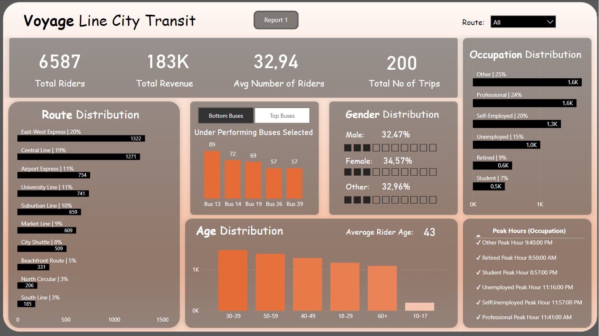

# Dashboards
Hello! These are some dashboards that I have made while studying PBI

---

## Chess Dashboard

## Overview

This dashboard presents insights from a dataset comprising over 20,000 online chess games played on Lichess. The dataset includes detailed information such as moves, victor, rating, and opening details.

## Dataset Details

**Online Chess Games**
- Data for 20,000+ chess games played on Lichess, including moves, victor, rating, opening details, and more.

## Analysis

1. **Winning Statistics:**
   - What percentage of games were won by white? How many ended in a draw?

2. **Opening Moves:**
   - Which opening move was most frequently used in games in which black won? What about when white won?

3. **Rating Influence:**
   - What percentage of games are won by the player with the higher rating? Does this vary by piece color?

4. **Top Player Analysis:**
   - Which user won the most amount of games? In what percentage of those games was the user the higher-rated player?

Feel free to explore and visualize the data using the dashboard to gain more insights!

---

# Transportation Dashboard

## Overview

This dashboard provides a comprehensive analysis of the transportation sector in the city. It covers details such as bus occupancy, popular routes, passenger demographics, and peak hours.

## Dataset Details

**City Transportation Data**
- Information on bus occupancy, routes, passenger demographics, and timing.

## Analysis

1. **Bus Occupancy:**
   - Identify the most and least occupied buses.

2. **Route Analysis:**
   - Determine the busiest and least busy routes in the city.

3. **Passenger Demographics:**
   - Explore the distribution of age and occupation (work) among passengers to understand the target audience.

4. **Peak Hours:**
   - Identify the busiest and least busy times during the day.

Feel free to use the interactive features of the dashboard to delve deeper into the transportation data!

---
